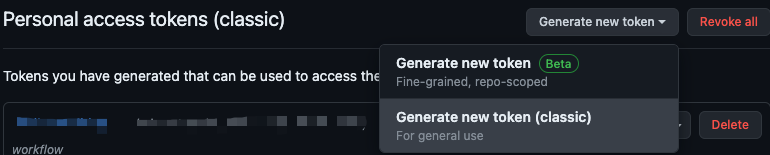
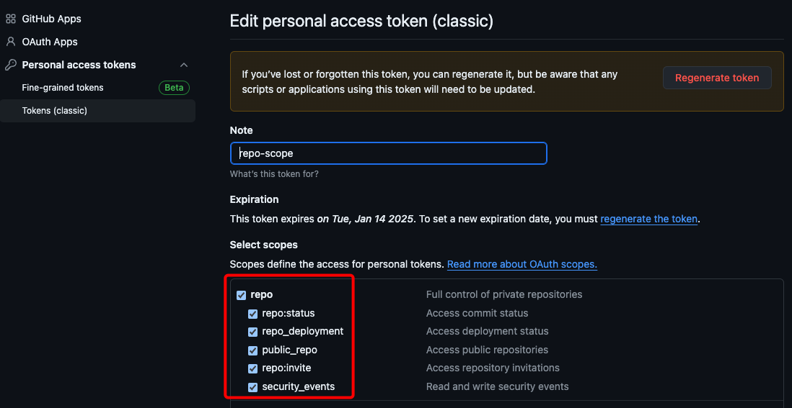
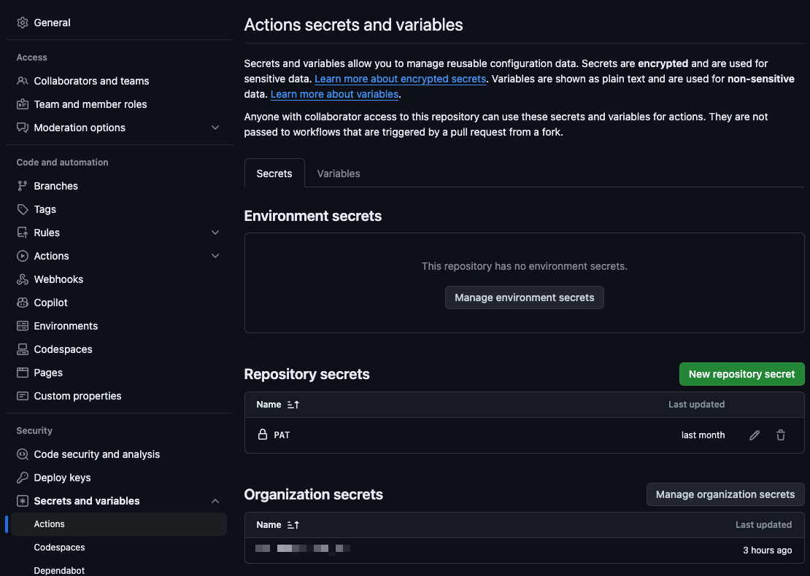
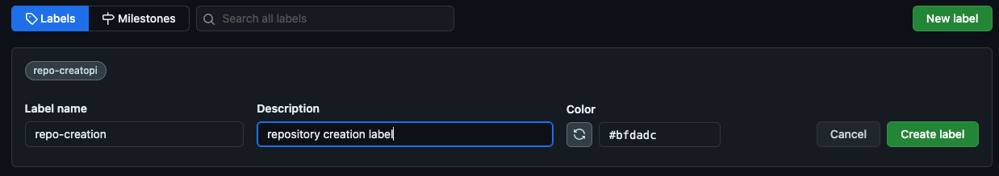

# repo-automation

This is an example repository for using various GitHub Actions related to repositories including issue templates as well

## create-repo from a repository template POC

### Prerequisites

A PAT (classic) that has all repository permissions




### Setup of an actions environment variable

PAT with full repository scope permissions

### Organization settings to prevent repository creation

```shell
Repository Settings > Actions > Actions Secrets and Variables
```



```shell
Organization Settings > Member privileges > Repository Creation > Uncheck all boxes and save
OR enterprise policies > repositories > Repository creation > Disabled
```

### Repository `repo-creation` label

```shell
Repository Issues > Labels
```



### Repo structure

```shell
.github
.github/ISSUE_TEMPLATE
.github/workflows/
```

### Issue template

`.github/ISSUE_TEMPLATE/repo_creation.yaml`

#### Change the following for your environment

- Replace `<ORG>` below with your githuib.com organization
- Replace `<REPO_TEMPLATE_NAME>` below with the repository that is the template

```yaml
name: Create Repo
description: Create a new repo
title: "[REPO]: "
labels: ["repo-creation"]
body:
  - type: markdown
    attributes:
      value: |
        Choose your repo to create
  - type: input
    id: repo-name
    attributes:
      label: Repo name
      description: The name of your repository, must be unique in the organization
      placeholder: my-awesome-repo
    validations:
      required: true
  - type: dropdown
    id: template
    attributes:
      label: Repository Template
      description: What template you want to start from
      options:
        - <ORG>/<REPO_TEMPLATE_NAME>
      default: 0
    validations:
      required: true
```

### GitHub Action to create a repository

`.github/workflows/create-repo.yml`

```yaml
name: Create Repository

on:
  issues:
    types: 
      - opened
jobs:
  build:
    runs-on: ubuntu-latest
    if: contains(github.event.issue.labels.*.name, 'repo-creation')
    steps:
      - uses: actions/checkout@v3

      ## validate the deetz
      - uses: stefanbuck/github-issue-parser@v3
        id: issue-parser
        with:
          template-path: .github/ISSUE_TEMPLATE/repo_creation.yaml
      
      # Don't run if a field is empty
      - name: Test variables
        run: |
          if [[ -z "${{ steps.issue-parser.outputs.issueparser_repo-name }}" || -z "${{ steps.issue-parser.outputs.issueparser_template }}" ]] \
            || -z "${{ steps.issue-parser.outputs.issueparser_branch-name }}" ]]; then
            echo Please submit a new issue and fill out ALL the fields
            exit 1
          fi
          ## Todo write this to the issue, maybe allow a /rerun command

      # Check if repo by the name already exists and notify in issue/exit if it does
      - name: Checking for repo existance
        id: checkRepo
        env:
          GH_TOKEN: ${{ secrets.PAT }}
        run: |
          if gh api /repos/${{ github.repository_owner }}/${{ steps.issue-parser.outputs.issueparser_repo-name }} > /dev/null 2>&1; then
            echo "::set-output name=exists::true"
          else
            echo "::set-output name=exists::false"
          fi

      - name: Create the repository
        id: createRepo
        continue-on-error: true
        if: steps.checkRepo.outputs.exists == 'false'
        env:
          GITHUB_TOKEN: ${{ secrets.PAT }}
        run: |
          # do this https://docs.github.com/en/rest/repos/repos?apiVersion=2022-11-28#create-a-repository-using-a-template
          gh api \
            --method POST \
            -H "Accept: application/vnd.github+json" \
            -H "X-GitHub-Api-Version: 2022-11-28" \
            /repos/${{ steps.issue-parser.outputs.issueparser_template }}/generate \
            -f owner='${{ github.repository_owner }}' \
            -f name='${{ steps.issue-parser.outputs.issueparser_repo-name }}' \
            -f description='This a generated repo' \
            -F include_all_branches=true \
            -F private=true

      - name: Comment success on repository creation
        if: steps.createRepo.outcome == 'success' && steps.checkRepo.outputs.exists == 'false'
        env:
          GH_TOKEN: ${{ secrets.PAT }}
        run: |
          gh issue comment ${{ github.event.issue.number }} \
            --body "The repository ${{ steps.issue-parser.outputs.issueparser_repo-name }} has been successfully created."

      - name: Comment failure on repository creation
        if: steps.createRepo.outcome == 'failure' && steps.checkRepo.outputs.exists == 'false'
        env:
          GH_TOKEN: ${{ secrets.PAT }}
        run: |
          gh issue comment ${{ github.event.issue.number }} \
            --body "There was an error creating the repository ${{ steps.issue-parser.outputs.issueparser_repo-name }}. Please try again."

      - name: Add user as an admin of the repository
        id: addUserAsAdmin
        if: steps.createRepo.outcome == 'success' && steps.checkRepo.outputs.exists == 'false'
        env:
          GH_TOKEN: ${{ secrets.PAT }}
        run: |
          gh api -X PUT /repos/${{ github.repository_owner }}/${{ steps.issue-parser.outputs.issueparser_repo-name }}/collaborators/${{ github.event.issue.user.login }} -f permission=admin

      - name: Comment success adding user as admin
        if: steps.addUserAsAdmin.outcome == 'success' && steps.checkRepo.outputs.exists == 'false'
        env:
          GH_TOKEN: ${{ secrets.PAT }}
        run: |
          gh issue comment ${{ github.event.issue.number }} \
            --body "The user ${{ github.event.issue.user.login }} was successsfully added as an admin of the repository"
  
      - name: Comment failure on adding user as admin
        if: steps.addUserAsAdmin.outcome == 'failure' && steps.checkRepo.outputs.exists == 'false'
        env:
          GH_TOKEN: ${{ secrets.PAT }}
        run: |
          gh issue comment ${{ github.event.issue.number }} \
            --body "There was an error adding user ${{ github.event.issue.user.login }} as an admin of the repository. Please try again."    

      - name: TODO Add users/teams permissions to repo
        if: steps.createRepo.outcome == 'success'
        run: |
          # Comment back to issue & close issue. Add Github.actor as admin, add teams specified
          echo "teams todo"
  
      - name: Close issue
        if: steps.createRepo.outcome == 'success'
        env:
          GH_TOKEN: ${{ secrets.PAT }}
        run: |
          gh issue close ${{ github.event.issue.number }}
  ```

### GitHub Action to add a team to a repository

`.github/workflows/add-teams.yml`

Usage: comment in an issue with the "repo-creation" label `/add-teams repo_name team1 team2 team3` 

```yaml
name: Add Teams to Repository
# /add-teams repo_name team1 team2 team3

on:
  issue_comment:
    types: [created]

jobs:
  add_teams:
    runs-on: ubuntu-latest
    if: contains(github.event.comment.body, '/add-teams')
    steps:
    - name: Check if user is admin of the repository
      id: checkAdmin
      env:
        GH_TOKEN: ${{ secrets.PAT }}
      run: |
        ARGS=$(echo '${{ github.event.comment.body }}' | awk -F'/add-teams ' '{print $2}' | tr -d '\r')
        ARG_ARRAY=($(echo "$ARGS"))
        REPO_NAME=${ARG_ARRAY[0]}
        IS_ADMIN=$(gh api -X GET /repos/${{ github.repository_owner }}/$REPO_NAME/collaborators/${{ github.event.comment.user.login }}/permission --jq '.permission == "admin"')
        echo "is_admin=$IS_ADMIN"
        echo "is_admin=$IS_ADMIN" >> $GITHUB_OUTPUT

    - name: Create comment in the issue if the user is not an admin
      if: steps.checkAdmin.outputs.is_admin == 'false'
      id: createCommentOnNotAdmin
      env:
        GH_TOKEN: ${{ secrets.PAT }}
      run: |
        ARGS=$(echo '${{ github.event.comment.body }}' | awk -F'/add-teams ' '{print $2}' | tr -d '\r')
        ARG_ARRAY=($(echo "$ARGS"))
        REPO_NAME=${ARG_ARRAY[0]}
        gh issue comment ${{ github.event.issue.number }} --repo ${{ github.repository }} --body "You are not an admin of the repository $REPO_NAME, you need to be an admin to add teams to the repository"

    - name: Add teams to the repository
      if: steps.checkAdmin.outputs.is_admin == 'true'
      id: addTeams
      env:
        GH_TOKEN: ${{ secrets.PAT }}
      continue-on-error: true
      run: |
        ARGS=$(echo '${{ github.event.comment.body }}' | awk -F'/add-teams ' '{print $2}' | tr -d '\r')
        ARG_ARRAY=($(echo "$ARGS"))
        REPO_NAME=${ARG_ARRAY[0]}
        echo "Adding teams to the repository $REPO_NAME"
        ARG_ARRAY=("${ARG_ARRAY[@]:1}")
        echo "Teams to add: ${ARG_ARRAY[@]}"
        for TEAM in "${ARG_ARRAY[@]}"; do
            gh api -X PUT /orgs/${{ github.repository_owner }}/teams/$TEAM/repos/${{ github.repository_owner }}/$REPO_NAME -f permission=admin
            if [ $? -eq 0 ]; then
              gh issue comment ${{ github.event.issue.number }} --repo ${{ github.repository }} --body "Team $TEAM added to the repository $REPO_NAME successfully"
            else
              gh issue comment ${{ github.event.issue.number }} --repo ${{ github.repository }} --body "Error adding team $TEAM to the repository $REPO_NAME, check the if you are a repo admin and the team exists"
            fi
        done
```
